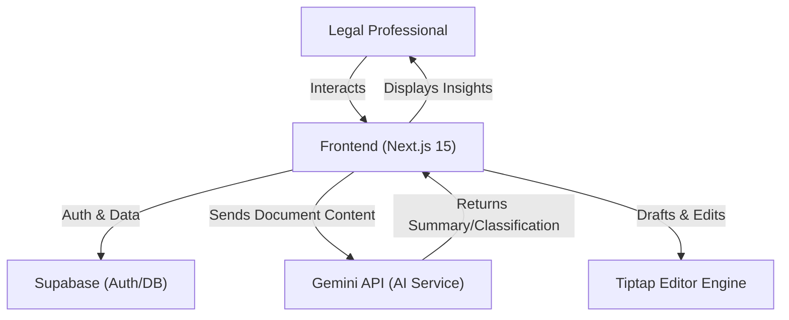

# AI-powered Document Summarizer and Classifier


an intelligent legal research assistant that leverages **Google's Gemini AI** to summarize complex legal documents and classify cases, built with **Next.js 15** and **Supabase**.

---

## 🚀 Key Features

-   **AI Summarization**: Instantly summarize lengthy legal documents using Gemini 2.0 Flash Lite.
-   **Case Research**: Advanced filtering and sorting for legal cases to find relevant precedents quickly.
-   **Rich Text Workspace**: Integrated Tiptap editor allows for drafting, annotating, and managing legal documents directly in the browser.
-   **Case Resource Library**: Access a curated library of resources including articles and webinars.
-   **Secure Authentication**: Robust user management and data protection powered by Supabase.
-   **Modern UI**: A clean, responsive interface built with Tailwind CSS and Radix UI.

---

## 🏗 System Architecture



---

## 🛠 Tech Stack

### **Frontend**
-   **Framework**: [Next.js 15](https://nextjs.org/) (App Router)
-   **Language**: [TypeScript](https://www.typescriptlang.org/)
-   **Styling**: [Tailwind CSS v4](https://tailwindcss.com/)
-   **UI Components**: [Radix UI](https://www.radix-ui.com/) / [Lucide Icons](https://lucide.dev/)
-   **Editor**: [Tiptap](https://tiptap.dev/)

### **Backend & Services**
-   **BaaS**: [Supabase](https://supabase.com/) (PostgreSQL, Auth)
-   **AI Model**: [Google Gemini 2.0 Flash Lite](https://deepmind.google/technologies/gemini/)
-   **AI SDK**: Google Generative AI SDK

---

## 🏁 Getting Started

### Prerequisites
-   **Node.js** (v20+)
-   **npm** or **pnpm**
-   **Supabase Account**
-   **Google Cloud API Key** (for Gemini)

### Installation

1.  **Clone the Repository**
    ```bash
    git clone https://github.com/logan-codes/AI-powered-document-summarizer-and-classifier.git
    cd AI-powered-document-summarizer-and-classifier
    ```

2.  **Install Dependencies**
    ```bash
    npm install
    # or
    pnpm install
    ```

3.  **Set Up Environment Variables**
    Create a `.env.local` file in the root directory:
    ```env
    NEXT_PUBLIC_SUPABASE_URL=your_supabase_url
    NEXT_PUBLIC_SUPABASE_ANON_KEY=your_supabase_anon_key
    GEMINI_API_KEY=your_gemini_api_key
    ```

4.  **Run the Development Server**
    ```bash
    npm run dev
    ```

5.  **Access the App**
    Open [http://localhost:3000](http://localhost:3000) in your browser.

---

## 📖 Usage Guide

### 1. Document Summarization
1.  Navigate to the **Summarizer** tool.
2.  Paste your legal text or upload a document.
3.  Click **Summarize**.
4.  View the AI-generated summary, key points, and action items.

### 2. Case Research
1.  Go to the **Case Research** section.
2.  Use the search bar and filters to find specific case laws.
3.  Click on a case to view details and AI-generated classification tags.

---

## 📂 Project Structure

```bash
AI-powered-document-summarizer-and-classifier/
├── src/
│   ├── app/             # App Router pages and layouts
│   ├── components/      # Reusable UI components
│   ├── lib/             # Utility functions & API clients
│   └── types/           # TypeScript definitions
├── public/              # Static assets
├── eslint.config.mjs    # ESLint configuration
├── next.config.ts       # Next.js configuration
├── package.json         # Dependencies and scripts
└── README.md            # You are here
```

---

## 🤝 Contributing

Contributions are welcome! Please fork the repository and create a pull request with your changes.

1.  Fork the Project
2.  Create your Feature Branch (`git checkout -b feature/AmazingFeature`)
3.  Commit your Changes (`git commit -m 'Add some AmazingFeature'`)
4.  Push to the Branch (`git push origin feature/AmazingFeature`)
5.  Open a Pull Request

---

## 📄 License

This project is licensed under the MIT License.
